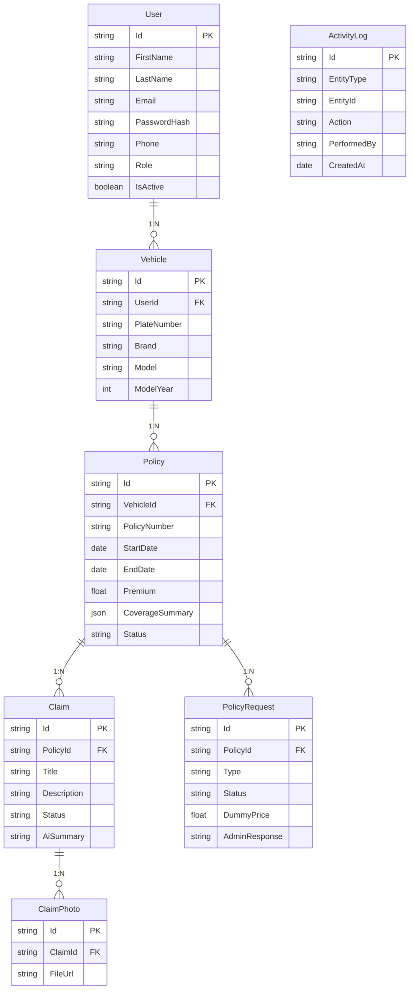

```mermaid

erDiagram
    User {
        string Id PK
        string FirstName
        string LastName
        string Email
        string PasswordHash
        string Phone
        string Role
        boolean IsActive
    }

    Vehicle {
        string Id PK
        string UserId FK
        string PlateNumber
        string Brand
        string Model
        int ModelYear
    }

    Policy {
        string Id PK
        string VehicleId FK
        string PolicyNumber
        date StartDate
        date EndDate
        float Premium
        json CoverageSummary
        string Status
    }

    Claim {
        string Id PK
        string PolicyId FK
        string Title
        string Description
        string Status
        string AiSummary
    }

    PolicyRequest {
        string Id PK
        string PolicyId FK
        string Type
        string Status
        float DummyPrice
        string AdminResponse
    }

    ClaimPhoto {
        string Id PK
        string ClaimId FK
        string FileUrl
    }

    ActivityLog {
        string Id PK
        string EntityType
        string EntityId
        string Action
        string PerformedBy
        date CreatedAt
    }

    User ||--o{ Vehicle : "1:N"
    Vehicle ||--o{ Policy : "1:N"
    Policy ||--o{ Claim : "1:N"
    Policy ||--o{ PolicyRequest : "1:N"
    Claim ||--o{ ClaimPhoto : "1:N"
```