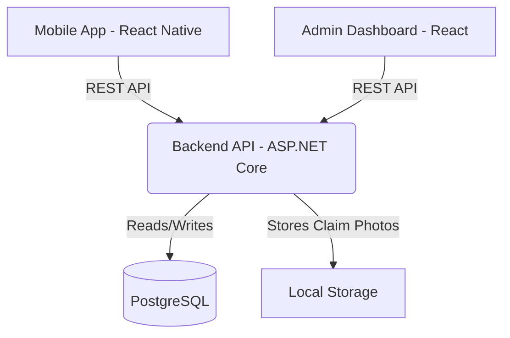

# 8. System Architecture

## 1. Overview
Projemiz "Insurance Operations Portal"; Backend API (ASP.NET Core), Admin Dashboard (React) ve Mobile Application (React Native) olmak üzere 3 bağımsız uygulamadan oluşmaktadır. Uygulamalar arası iletişim REST API ile sağlanır ve yetkilendirme (authorization/authentication) işlemleri JWT (JSON Web Token) kullanılarak güvenli bir şekilde gerçekleştirilir. Backend sistemi; tüm iş mantığının (business logic), doğrulamaların (validation) ve veritabanı yönetiminin merkezi olarak sorumlu olup, istemciler yalnızca sunum katmanı görevini üstlenir.

## 2. High Level Architecture



*(Not: MVP aşamasından sonra Local Storage yerine MinIO object storage eklenebilir.)*

## 3. Backend Architecture
Sistem "Clean Architecture" (Temiz Mimari) prensiplerine uygun olarak 4 temel katmana ayrılmıştır:

1. **Domain Layer:** (Entities, Enums, Business Rules). Bağımlılığı yoktur (No dependency). Sistemdeki çekirdek iş kurallarını tanımlar.
2. **Application Layer:** (DTOs, Services, Interfaces, Validation). Entity Framework Core bağımlılığı yoktur. API isteklerini işler ve Domain katmanındaki iş kurallarını uygular.
3. **Infrastructure Layer:** (EF Core, Repository, Database, JWT, File Storage). Dış dünyaya açılan veya altyapısal servisleri (Örn: Veritabanı bağdaştırıcıları, Token oluşturucular) barındırır.
4. **Presentation Layer:** (Controllers, Swagger, Auth, API Endpoints). İstemcilerden gelen REST isteklerini karşılar ve Application katmanına yönlendirir.

Akış: `Presentation -> Application -> Domain <- Infrastructure` (Infrastructure hem Domain hem de Application abstractlarını implemente eder).

## 4. Folder Structure

### Backend (ASP.NET Core)
```text
src/
├── ClaimFlow.Domain/
│   ├── Entities/
│   ├── Enums/
│   └── Exceptions/
├── ClaimFlow.Application/
│   ├── DTOs/
│   ├── Interfaces/
│   ├── Services/
│   └── Validations/
├── ClaimFlow.Infrastructure/
│   ├── Data/ (DbContext, Migrations)
│   ├── Repositories/
│   └── Services/ (JWT, FileStorage)
└── ClaimFlow.API/ (Presentation)
    ├── Controllers/
    ├── Middlewares/
    └── Program.cs
```

### Dashboard (React)
```text
src/
├── components/     # Reusable UI components
├── features/       # Feature-based structural modules (e.g., claims, policies)
├── pages/          # Route/Page level components
├── services/       # API call definitions
├── utils/          # Helpers and constants
├── store/          # State management (Redux/Zustand)
└── App.tsx
```

### Mobile (React Native)
```text
src/
├── app/            # Navigation & App setup
├── components/     # Shared mobile UI components
├── screens/        # Screen-level views
├── services/       # API integration
└── theme/          # Styling and constants
```

## 5. Communication
Veri akışı şu şekilde gerçekleşir:
1. İstemci (Örn: Dashboard), REST API üzerinden bir HTTP Request gönderir (Controller).
2. API Controller isteği alır, DTO'ya dönüştürülmüş veriyi Validation kurallarından geçirir ve Application Service'e aktarır.
3. Application Service iş kurallarını işletir (Business Logic) ve Infrastructure katmanında yer alan ilgili Repository metodunu çağırır.
4. Repository, PostgreSQL veritabanı üzerinde gerekli CRUD işlemini gerçekleştirir ve Entity'yi geri döndürür.
5. Entity, Service düzeyinde tekrar DTO'ya map edilerek kullanıcıya Response olarak sunulur.

## 6. Authentication
Sistem, Stateless ve Security merkezli bir yetkilendirme olarak JWT (JSON Web Token) Access Token ve Refresh Token altyapısını kullanır.
- Tüm korumalı uç noktalara (endpoints) Authorization header içinde `Bearer <Token>` formatında erişim sağlanır.
- Roller: **Admin** ve **Customer**. Admin tüm verilere ve rollere erişebilirken, Customer yalnızca kendisiyle ilişkili (User.Id) kayıtlara ulaşabilir.

## 7. Error Handling
Global Exception Middleware kullanılarak, API'den dönecek olan her hata standart bir JSON yapısına büründürülür:

```json
{
  "success": false,
  "data": null,
  "message": "Validation failed.",
  "errors": [
    "Email is properly formatted but already exists.",
    "Password must be at least 8 characters long."
  ]
}
```

## 8. Logging
Sistemde iki farklı loglama konsepti uygulanacaktır, bu ayrım sistemin izlenebilirliği için kritiktir:
*   **Serilog (Technical):** Hatalar, sistem istisnaları, performans uyarıları ve uygulama çalışma döngüsü hakkında altyapısal kayıtları tutar.
*   **ActivityLog (Business):** İş mantığındaki durum değişiklikleri için (`EntityId`, `EntityType`, `Action`, `PerformedBy`). Örneğin: "Claim oluşturuldu", "Poliçe yenileme talebi onaylandı" kayıtları PostgreSQL'de tutulur.

## 9. File Storage
Hasar (Claim) fotoğrafları ve pdf yüklemeleri şimdilik uygulamanın çalıştığı sunucudaki Local Storage dosya sistemine kaydedilecektir. Veritabanında (PostgreSQL) sadece erişilebilir dosya yolu (URL / path) saklanacaktır.

## 10. Future Improvements
MVP sonrasında eklenebilecek teknik geliştirmeler:
*   **MinIO:** Dosya yönetimi için kalıcı, S3 uyumlu Object Storage çözümü.
*   **Redis:** Ortak kullanılan sorgular (Örn: Aktif poliçeler listesi) ve Rate Limiting için In-Memory Cache.
*   **Background Jobs (Hangfire/Quartz):** Gecikmeli e-posta bildirimleri ve PDF üretimi işlemleri için.
*   **Notification Service:** RabbitMQ gibi bir message broker ile asenkron push notification & SMS gönderimi.
*   **Microservices:** Talep ve Hasar modüllerinin ayrı API'lere bölünmesi.
